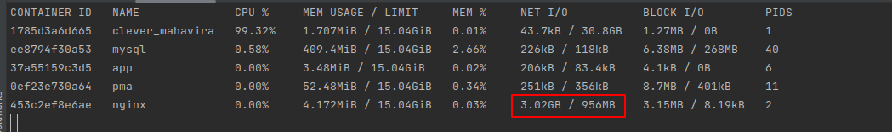
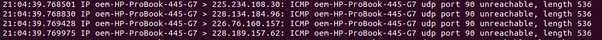

# DDoS
Test different kind of DDoS Attacks to local machine with protect from them

Make a table in mysql Database use this sql query:

`
CREATE TABLE users (
id INT NOT NULL AUTO_INCREMENT,
firstname VARCHAR(50) NOT NULL,
lastname VARCHAR(50) NOT NULL,
email VARCHAR(255) NOT NULL,
password VARCHAR(255) NOT NULL,
date_of_birth DATE NOT NULL,
created_at TIMESTAMP DEFAULT CURRENT_TIMESTAMP,
PRIMARY KEY (id)
);
`

For start DDoS process need to run bash script `build/attack/script.sh`
This script run off different ways of DDoS attacks. If our network input increase it is works. Sure that you pass correct ip address of network.

For upd flood we don't need to do nothing because we not support upd protocol in our configuration

There is protect nginx configuration in `build/nginx/nignx-protect.conf` for protection use:
`client_header_timeout`
`client_body_timeout`
`limit_req`
`limit_conn`

For some cases we can use `deny`, `allow` and start `user_agent` for protecting from dangerous activity.
